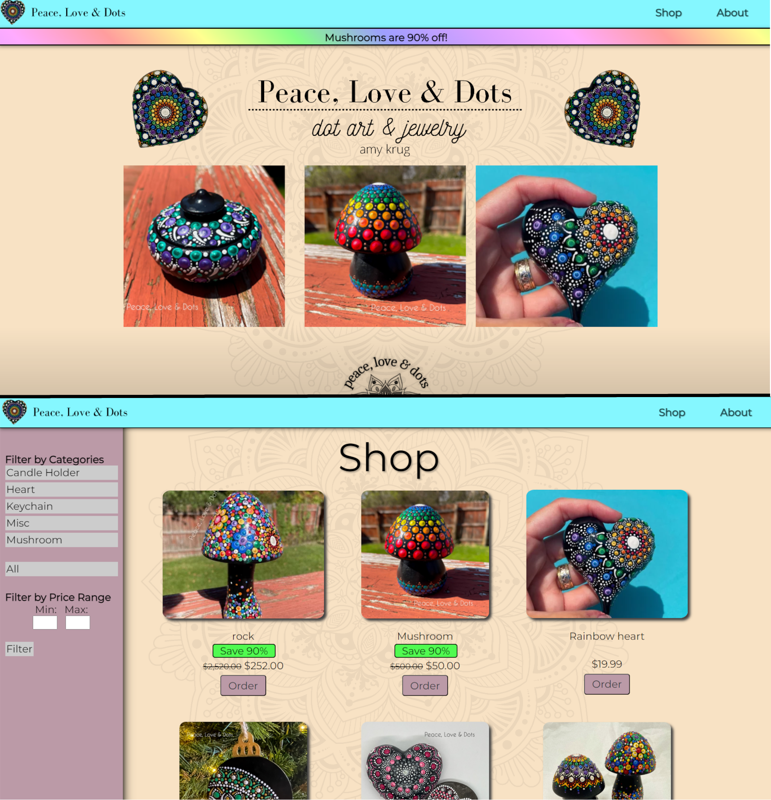

# RockSite

RockSite is a website developed for a small business owner selling hand-painted rocks on Etsy. This project features a full ordering system integrated with PayPal, allowing users to purchase items securely. The backend provides functionality for product management and order tracking. The site was built by a team of four, including myself.

## Features

- **Ordering System**: Full integration with PayPal, allowing customers to place orders directly through the website.
- **Product Management**: 
  - Add, remove, and modify products via the backend.
  - View and track customer orders.
- **Session Timeout**: For security, the authentication system has a session timeout feature that logs users out after 15 minutes of inactivity.
- **Frontend Design**: Clean and responsive interface built using HTML, CSS, and JavaScript.
  
## Tech Stack

- **Frontend**: 
  - HTML5
  - CSS3
  - JavaScript
- **Backend**: 
  - PHP
  - MySQL (for the database)
- **Database**: MySQL
- **Version Control**: GitHub

## Screenshots

Here are some previews of the website:

<i>Front-End of RockSite</i>

<i>Back-End of RockSite</i>

## Credits

Site created by Caden Conde, John Jones, Eric Bucher, and Xander Combs for 2022-23 Miami Valley Tech Prep Showcase

